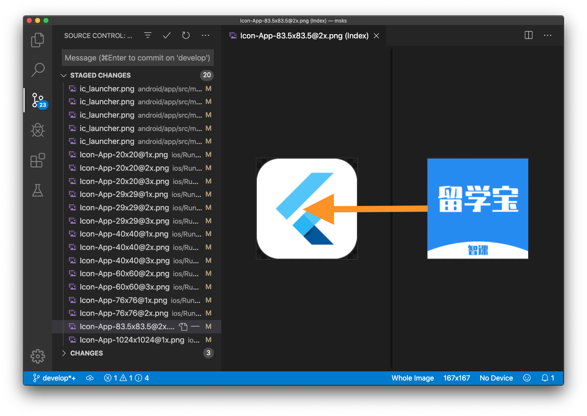

# flutter_logo_updater
Tool to update all app icons in flutter project

## Installing:
```bash
pip install flutter_logo_updater
```

## Using:
flutter_logo_updater logo_file_path project_file_path

Exmple:
```txt

caojianfeng$ flutter_logo_updater msks/images/logo_lxb.png  msks

==================================================
PROJECT LOGO Updating...
        In /Users/caojianfeng/Documents/w/msks
        With /Users/caojianfeng/Documents/w/msks/images/logo_lxb.png

--------------------------------------------------
[01/20]->(48*48)        /Users/caojianfeng/Documents/w/msks/android/app/src/main/res/mipmap-mdpi/ic_launcher.png
[02/20]->(72*72)        /Users/caojianfeng/Documents/w/msks/android/app/src/main/res/mipmap-hdpi/ic_launcher.png
[03/20]->(96*96)        /Users/caojianfeng/Documents/w/msks/android/app/src/main/res/mipmap-xhdpi/ic_launcher.png
[04/20]->(144*144)      /Users/caojianfeng/Documents/w/msks/android/app/src/main/res/mipmap-xxhdpi/ic_launcher.png
[05/20]->(192*192)      /Users/caojianfeng/Documents/w/msks/android/app/src/main/res/mipmap-xxxhdpi/ic_launcher.png
[06/20]->(20*20)        /Users/caojianfeng/Documents/w/msks/ios/Runner/Assets.xcassets/AppIcon.appiconset/Icon-App-20x20@1x.png
[07/20]->(29*29)        /Users/caojianfeng/Documents/w/msks/ios/Runner/Assets.xcassets/AppIcon.appiconset/Icon-App-29x29@1x.png
[08/20]->(40*40)        /Users/caojianfeng/Documents/w/msks/ios/Runner/Assets.xcassets/AppIcon.appiconset/Icon-App-20x20@2x.png
[09/20]->(40*40)        /Users/caojianfeng/Documents/w/msks/ios/Runner/Assets.xcassets/AppIcon.appiconset/Icon-App-40x40@1x.png
[10/20]->(58*58)        /Users/caojianfeng/Documents/w/msks/ios/Runner/Assets.xcassets/AppIcon.appiconset/Icon-App-29x29@2x.png
[11/20]->(60*60)        /Users/caojianfeng/Documents/w/msks/ios/Runner/Assets.xcassets/AppIcon.appiconset/Icon-App-20x20@3x.png
[12/20]->(76*76)        /Users/caojianfeng/Documents/w/msks/ios/Runner/Assets.xcassets/AppIcon.appiconset/Icon-App-76x76@1x.png
[13/20]->(80*80)        /Users/caojianfeng/Documents/w/msks/ios/Runner/Assets.xcassets/AppIcon.appiconset/Icon-App-40x40@2x.png
[14/20]->(87*87)        /Users/caojianfeng/Documents/w/msks/ios/Runner/Assets.xcassets/AppIcon.appiconset/Icon-App-29x29@3x.png
[15/20]->(120*120)      /Users/caojianfeng/Documents/w/msks/ios/Runner/Assets.xcassets/AppIcon.appiconset/Icon-App-40x40@3x.png
[16/20]->(120*120)      /Users/caojianfeng/Documents/w/msks/ios/Runner/Assets.xcassets/AppIcon.appiconset/Icon-App-60x60@2x.png
[17/20]->(152*152)      /Users/caojianfeng/Documents/w/msks/ios/Runner/Assets.xcassets/AppIcon.appiconset/Icon-App-76x76@2x.png
[18/20]->(167*167)      /Users/caojianfeng/Documents/w/msks/ios/Runner/Assets.xcassets/AppIcon.appiconset/Icon-App-83.5x83.5@2x.png
[19/20]->(180*180)      /Users/caojianfeng/Documents/w/msks/ios/Runner/Assets.xcassets/AppIcon.appiconset/Icon-App-60x60@3x.png
[20/20]->(1024*1024)    /Users/caojianfeng/Documents/w/msks/ios/Runner/Assets.xcassets/AppIcon.appiconset/Icon-App-1024x1024@1x.png
==================================================
```



## How does it work:

### 1. Find a config

Find a config from your_flutter_project/flutter_logo_updater.json (TODO)

If no config found a default cfg while be use.

```json
{
    "ios": {
        "appiconset": "ios/Runner/Assets.xcassets/AppIcon.appiconset"
    },
    "android": {
        "manifest": "android/app/src/main/AndroidManifest.xml"
    }
}
```

### 2. Find icon infos

To kown which png shoud be replaced.

#### 2.1 On iOS

##### 2.1.1 Find icons by the AppIcon.appiconset/Contents.json 

##### 2.1.2 Get the image_filename and size info from the json.

```json
{
  "images" : [
        {
            "size" : "20x20",
            "idiom" : "iphone",
            "filename" : "Icon-App-20x20@2x.png",
            "scale" : "2x"
        },
        {
            "..."
        }
    ]
}
```

#### 2.2 On Android

#### 2.2.1 Find the android:icon prop of manifest/application from AndroidManifest.xml

```xml
<manifest>
    <application
        android:icon="@mipmap/ic_launcher">
        <!-- ... -->
    </application>
</manifest>
```

##### 2.2.2 Parse base_dir from android:icon

So flutter_logo_updater kown which dir to search, mipmap or drawble.

##### 2.2.3 Search png files and read their size.

### 3. Resize you logo(1024*1024) to sizes of the icons and replace them. 


### 4. TODO

1. Find a config from your_flutter_project/flutter_logo_updater.json
2. Cut down size of the icons by [pngquant](https://pngquant.org/)